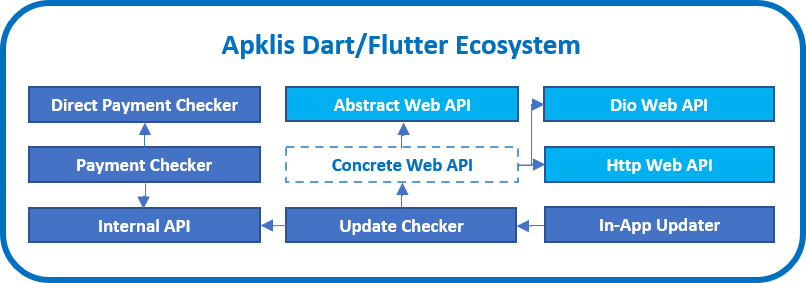

    

 

 <!-- ALL-CONTRIBUTORS-BADGE:START - Do not remove or modify this section -->

<!-- ALL-CONTRIBUTORS-BADGE:END -->

---

Ecosistema de [paquetes](https://pub.dev) para [Dart](https://dart.dev) y [Flutter](https://flutter.dev) desarrollados y mantenidos por la comunidad de [Flutter Cuba](https://github.com/fluttercuba) relacionados con la tienda cubana de aplicaciones para dispositivos Android llamada [Apklis](https://apklis.cu).

## Paquetes 🚀💙

## Contribuidores ✨

Gracias a estas personas maravillosas ([emoji key](https://allcontributors.org/docs/en/emoji-key)):

<!-- ALL-CONTRIBUTORS-LIST:START - Do not remove or modify this section -->
<!-- prettier-ignore-start -->
<!-- markdownlint-disable -->
<table>
  <tr>
    <td align="center"><a href="http://leynier.github.io"> <b>Leynier Gutiérrez González</b></a> <a href="https://github.com/fluttercuba/apklis-dart-flutter/commits?author=leynier" title="Code">💻</a> <a href="#maintenance-leynier" title="Maintenance">🚧</a> <a href="https://github.com/fluttercuba/apklis-dart-flutter/commits?author=leynier" title="Tests">⚠️</a> <a href="https://github.com/fluttercuba/apklis-dart-flutter/issues?q=author%3Aleynier" title="Bug reports">🐛</a></td>
  </tr>
</table>

<!-- markdownlint-restore -->
<!-- prettier-ignore-end -->

<!-- ALL-CONTRIBUTORS-LIST:END -->

Este proyecto sigue la especificación [all-contributors](https://github.com/all-contributors/all-contributors). ¡Las contribuciones de cualquier tipo son bienvenidas!
